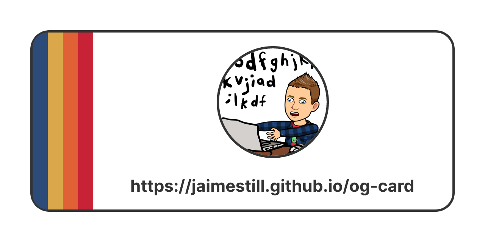

# Simple Red and Blue  

Profile picture by [bitmoji](https://www.bitmoji.com/).

Inspired by the design of [Starfield](https://bethesda.net/en/game/starfield).



```jsx
<div
  style={{
    height: '100%',
    width: '100%',
    display: 'flex',
    backgroundColor: '#ffffff',
    fontWeight: 600,
    fontSize: 22
  }}
>
  <div
    style={{
      display: 'flex',
      flex: '1 1 auto',
      margin: 40,
      border: '3px solid #333333',
      borderRadius: 25
    }}
  >
    <div
      style={{
        height: '100%',
        width: 20,
        backgroundColor: '#2d4b79',
        borderTopLeftRadius: 25,
        borderBottomLeftRadius: 25
      }}
    >
    </div>
    <div
      style={{
        height: '100%',
        width: 20,
        backgroundColor: '#daa74a'
      }}
    >
    </div>
    <div
      style={{
        height: '100%',
        width: 20,
        backgroundColor: '#df6135'
      }}
    >
    </div>
    <div
      style={{
        height: '100%',
        width: 20,
        backgroundColor: '#c82236'
      }}
    >
    </div>
    <div
      style={{
        display: 'flex',
        flex: '1 1 auto',
        flexDirection: 'column',
        alignItems: 'center',
        justifyContent: 'center',
        gap: '24px'
      }}
    >
      
      <div
        style={{
          color: '#333333'
        }}
      >
        https://jaimestill.github.io/layered-api
      </div>
    </div>
  </div>
</div>
```